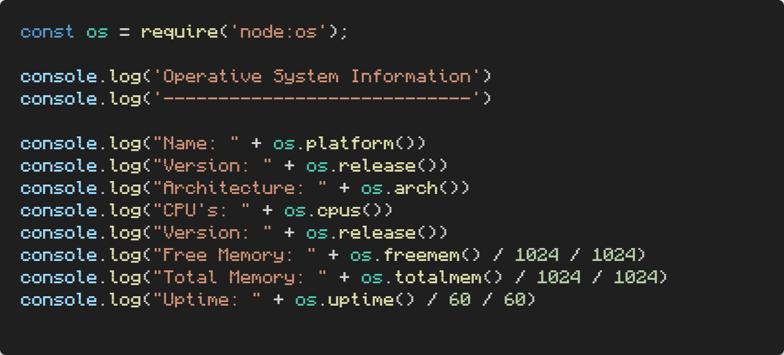

# Node practice
This repo is meant to be for practicing Node.js (v18.13.0).

Node.js is a JavaScript runtime environment.


## First logs.js
To run the logs of the file ```logs.js``` open the **terminal** and write ```node logs.js```.

Using ```console.log()``` works on both **terminal** or **browser**. The ```console.log()``` in reality should be written like this: ```globalThis.console.log()``` cause it is always refering logs as a global variable.

## globalThis variable
This variable has a lot of common methods used by software developers like 'console.log', 'fetch', etc.


### Variables
- **globalthis** ---> Logs the global variable. In Node.js points to "**global**" and in the browser points to "**window**".

## Imports
This design pattern allows us to separate files.

We can use the functions or methods that are in other files in the file we want using **CommonJS Modules** or **ES Modules**.

|**ES Modules**|**CommonJS Modules**|
|---|---|
|.png)|.png)|


## Node Native
Using **CommonJS** to import native 'os' to retrive information about our actual Operative System.



I also imported **'fs' (file system)** to retrive information about a specific file. This is an asyncronous task for.

.png)